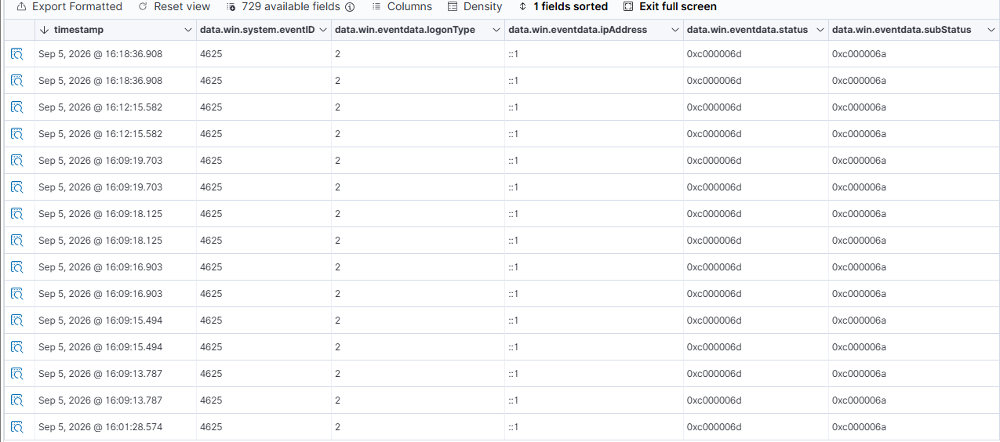
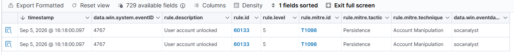
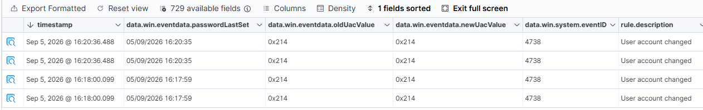
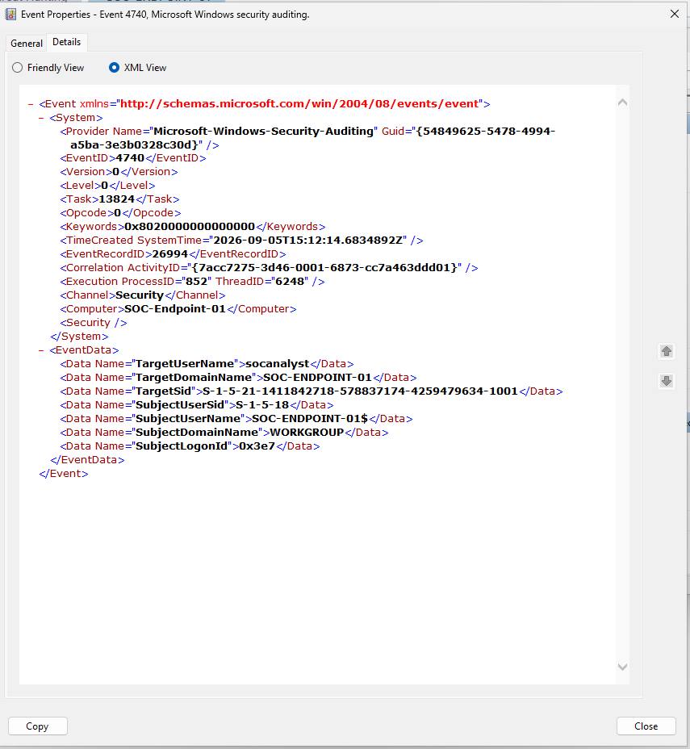

# Project 1 - Windows Security Log Investigation

## Day 2 - Authentication Event Analysis and Correlation

### Overview

For Day 2 I went back through the authentication events from Day 1 and looked at them in more detail.

Rather than just looking at the Wazuh alert names, I added some of the Windows event fields to the results table and compared the events. I also matched one of the Wazuh events back to the original event in Windows Event Viewer.

---

## Failed Logon Analysis

I started with the failed logon events (Event ID `4625`).

I added the logon type, status and substatus fields to the Wazuh table so I could see more information about each attempt.

The events showed:

- Event ID: `4625`
- Logon Type: `2`
- Status: `0xc000006d`
- SubStatus: `0xc000006a`

The failed attempts had the same values and occurred close together, which matched the failed logons I generated during the lab.

This also showed me that there is more useful information available in the event fields than what is shown in the main alert description.

---

## Account Unlock Event

I then looked at what happened when the `socanalyst` account was unlocked.

Wazuh recorded this as Event ID `4767`.

The event showed:

- Wazuh Rule ID: `60133`
- Rule Level: `5`
- Account: `socanalyst`
- MITRE ID: `T1098`
- MITRE Technique: `Account Manipulation`

This was also my first look at how Wazuh adds MITRE ATT&CK information to Windows events.

---

## Account Change Event

I also noticed Event ID `4738` with the description `User account changed`.

I looked at some of the fields inside the event to see what had actually changed.

The `passwordLastSet` values lined up with the times when changes were made to the account.

I also compared:

- `oldUacValue`: `0x214`
- `newUacValue`: `0x214`

Both values were the same, so I did not find a change to the UAC value in these events.

This was useful because just seeing `User account changed` did not tell me exactly what had happened. Looking at the fields gave me more information about the event.

---

## Matching a Wazuh Event to Windows

For the last part I wanted to check if I could trace a Wazuh event back to the exact event on the Windows machine.

I used the account lockout event (Event ID `4740`).

In Wazuh I found:

- Event Record ID: `26994`
- Target account: `socanalyst`
- System time: `2026-09-05T15:12:14.6834892Z`

I then opened Event ID `4740` in Windows Event Viewer and checked the XML.

The Windows event had:

- Event ID: `4740`
- Event Record ID: `26994`
- Time Created: `2026-09-05T15:12:14.6834892Z`
- Target User: `socanalyst`
- Computer: `SOC-Endpoint-01`

The Event Record ID and timestamp matched, so I could confirm that I was looking at the same event in both Windows Event Viewer and Wazuh.

---

## What I Found

By the end of Day 2 I had looked at the authentication activity in more detail rather than only relying on the main Wazuh alert descriptions.

I looked at failed logon fields, account unlock and account change events, MITRE information and then traced a Wazuh account lockout event back to the original Windows Security event.

The main thing I found useful was being able to use fields such as the Event ID, Event Record ID, timestamp and account name to investigate and compare events between Windows and Wazuh.
