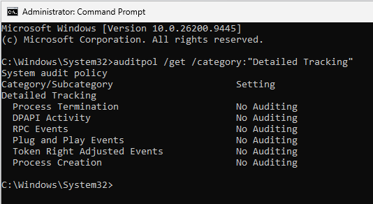
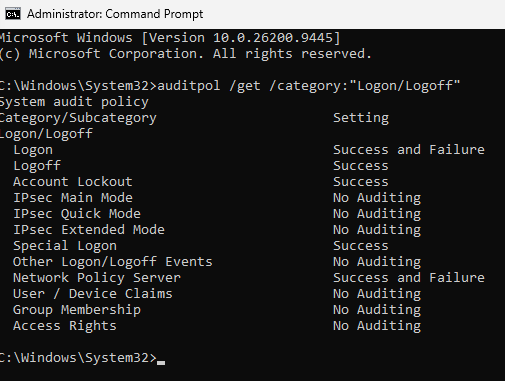
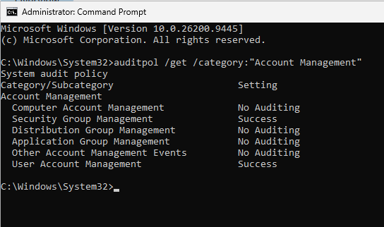
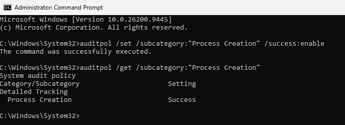
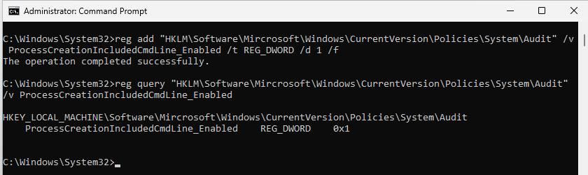
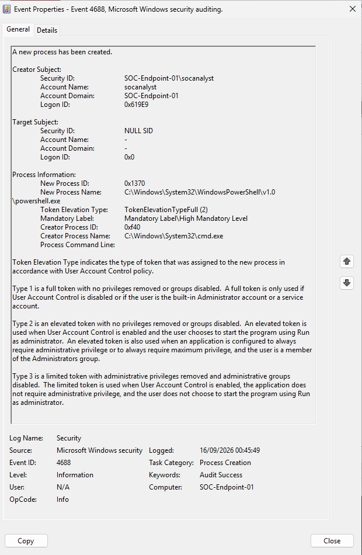
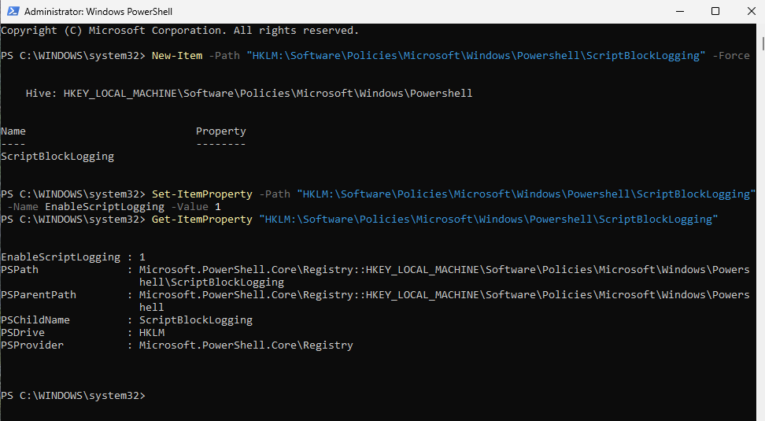
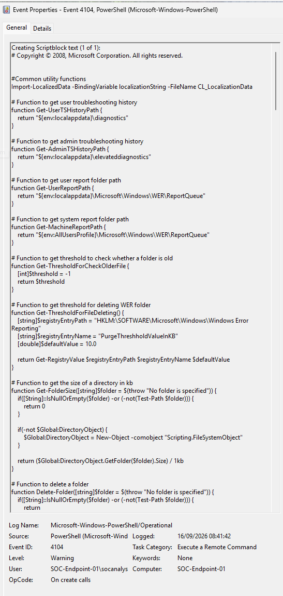
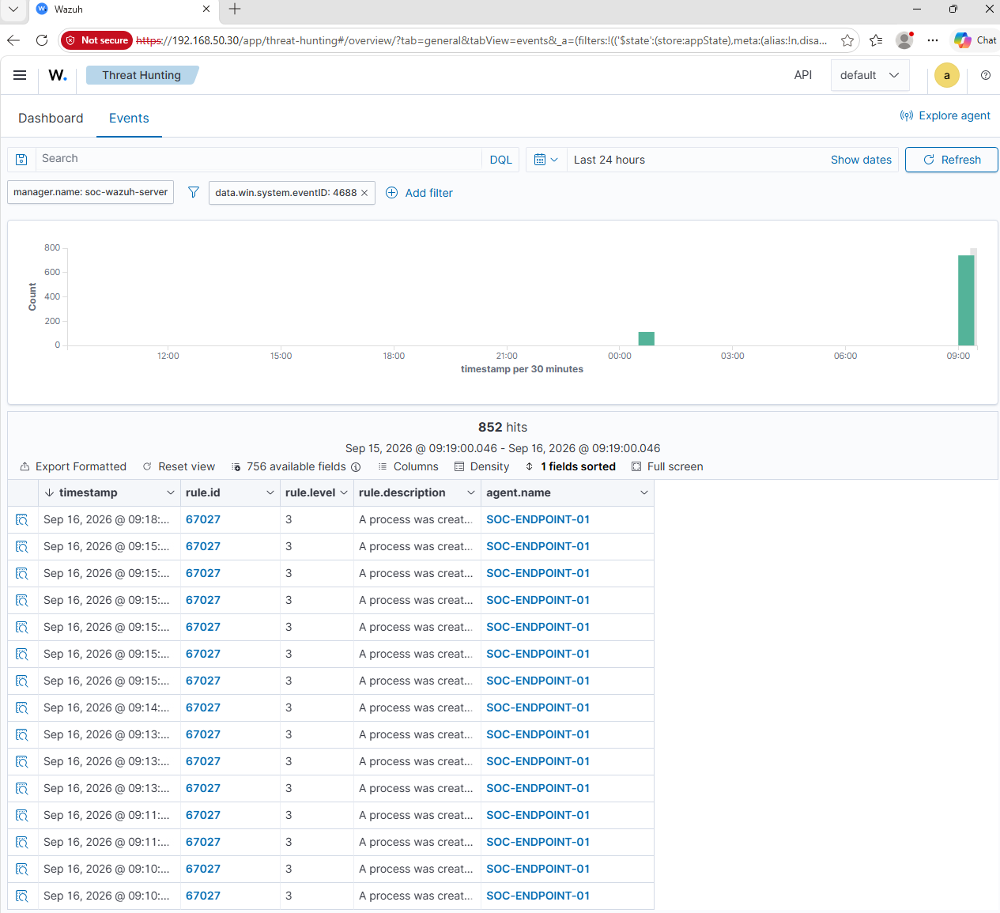
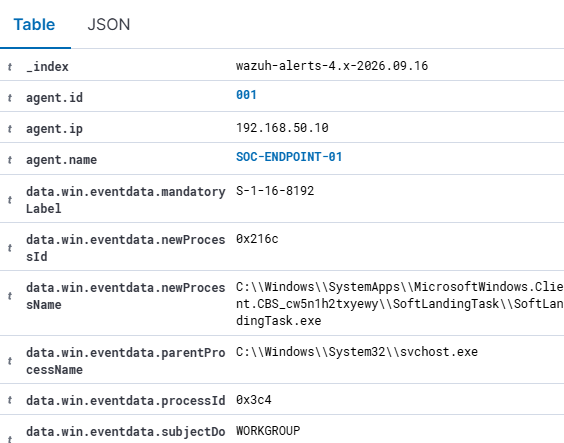

# Day 1 - Windows Logging and SIEM Telemetry

## Overview

The goal of Day 1 was to improve the visibility of the Windows endpoint before building SIEM detections.

I first reviewed the existing Windows audit configuration to understand which security events were already being recorded. I then enabled additional process and PowerShell logging to provide more useful telemetry for security monitoring and investigation.

The new logging was tested locally using Windows Event Viewer and then verified in Wazuh to confirm that the events were reaching the SIEM.

---

## Initial Audit Policy Review

Before making any changes, I reviewed the existing Windows audit configuration using `auditpol`.

I focused on three areas that are useful for security monitoring:

- Detailed Tracking
- Logon/Logoff
- Account Management

### Detailed Tracking

The Detailed Tracking policy showed that Process Creation auditing was disabled.

This was important because process creation events provide visibility into programs being executed on an endpoint.

Without this telemetry, investigating suspicious processes such as PowerShell, command shells or other executables would be more difficult.

### Logon and Logoff

I also reviewed the existing Logon/Logoff configuration.

The endpoint was already recording important authentication activity including successful and failed logons, logoffs and account lockouts.

These events provide useful information for investigating authentication attacks and suspicious account activity.

### Account Management

The Account Management configuration was also reviewed.

Some account management activity was already being audited, including security group management and user account management.

---

## Enabling Process Creation Auditing

The initial review showed that Process Creation auditing was disabled.

I enabled successful Process Creation auditing using:

`auditpol /set /subcategory:"Process Creation" /success:enable`

I then checked the configuration to confirm the change.

Process Creation auditing generates Windows Security Event ID `4688` whenever a new process is created.

This provides useful endpoint telemetry because it allows an analyst to identify which programs were executed and investigate suspicious process activity.

---

## Enabling Process Command-Line Auditing

Process creation events become more useful when command-line information is available because the executable name alone may not explain what a process was used to do.

I enabled command-line information for process creation events through the Windows audit configuration.

This provides additional context during investigations by allowing process execution and its associated arguments to be examined where they are recorded.

---

## Verifying Event ID 4688

After enabling Process Creation auditing, I launched PowerShell and inspected the Windows Security log.

Event Viewer successfully recorded Event ID `4688` for the PowerShell process.

The event contained useful investigation fields including:

- New Process Name
- New Process ID
- Creator Process ID
- Creator Process Name
- Account information
- Token elevation information

In this example, `powershell.exe` was created with `cmd.exe` recorded as its creator process.

This demonstrates how Event ID 4688 can be used to understand parent-child process relationships during an investigation.

---

## Enabling PowerShell Script Block Logging

Process creation logging shows that PowerShell was launched, but additional logging is required to gain visibility into PowerShell activity itself.

I therefore enabled PowerShell Script Block Logging.

Script Block Logging records PowerShell script content in the Microsoft-Windows-PowerShell Operational log and can provide valuable telemetry when investigating suspicious PowerShell activity.

---

## Verifying PowerShell Event ID 4104

After enabling Script Block Logging, I checked the PowerShell Operational log in Event Viewer.

Event ID `4104` events were successfully being generated.

Event ID 4104 records PowerShell script block content, providing deeper visibility than simply detecting that `powershell.exe` was executed.

This type of telemetry can help an analyst investigate PowerShell commands and scripts that may be associated with malicious activity.

---

## Verifying SIEM Ingestion in Wazuh

After validating the logging locally, I checked Wazuh Threat Hunting to confirm that the Windows events were being collected by the SIEM.

I filtered the events using Windows Event ID `4688`.

Wazuh returned hundreds of Process Creation events from `SOC-ENDPOINT-01`, confirming that the new Windows process telemetry was reaching the monitoring server.

This also demonstrated the amount of additional telemetry produced after enabling process auditing and the importance of filtering SIEM data during investigations.

---

## Inspecting Process Telemetry in Wazuh

I opened an individual 4688 event to examine how the Windows event data had been parsed by Wazuh.

The event contained fields including:

- `agent.name`
- `agent.ip`
- `data.win.eventdata.newProcessName`
- `data.win.eventdata.parentProcessName`
- `data.win.eventdata.processId`

These fields can be used when searching and correlating process activity in the SIEM.

For example, the process name can identify the executable that ran while the parent process can provide context about how that process was launched.

---

## What I Learned

Day 1 demonstrated the importance of endpoint logging configuration before attempting to build SIEM detections.

Simply installing a SIEM agent does not guarantee that all useful security telemetry is available. The endpoint must first be configured to record the activity that analysts want to detect.

I also gained practical experience working with:

- Windows advanced audit policies
- Event ID 4688 process creation events
- Parent-child process relationships
- Process command-line auditing
- PowerShell Script Block Logging
- Event ID 4104
- Windows Event Viewer
- Wazuh Threat Hunting
- SIEM event fields and filtering

The endpoint now provides more detailed process and PowerShell telemetry that can be used during the detection and investigation stages of the project.
