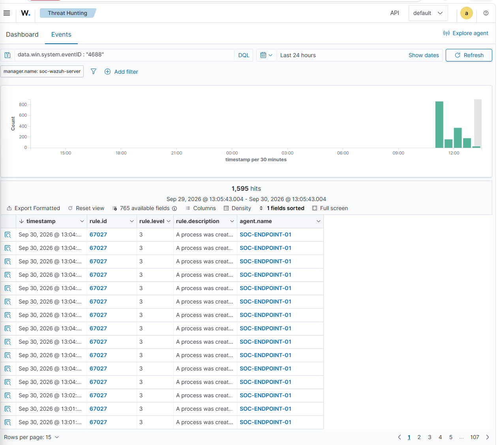
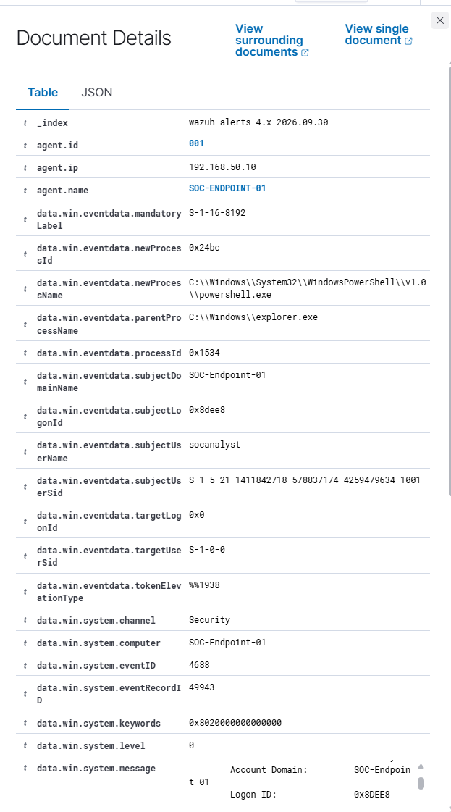
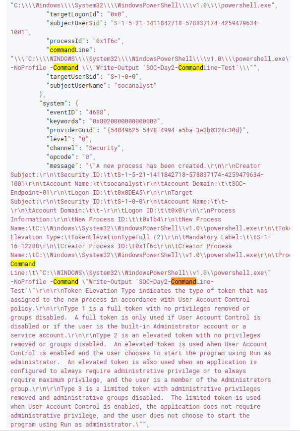
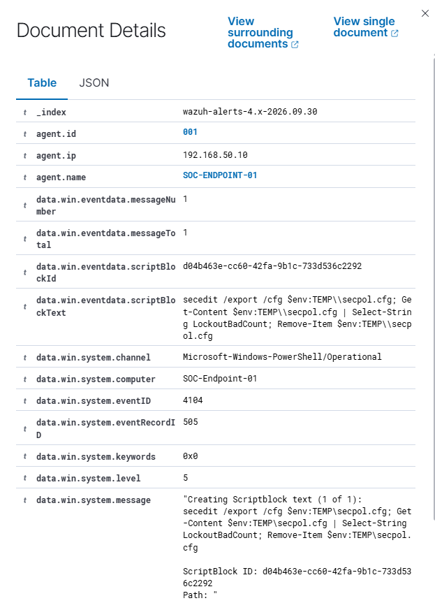
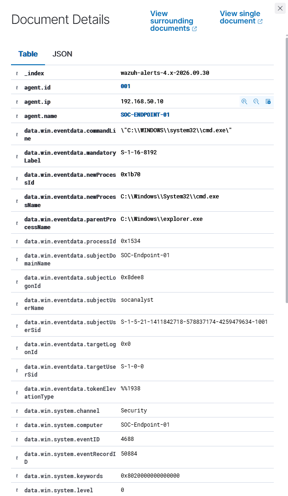
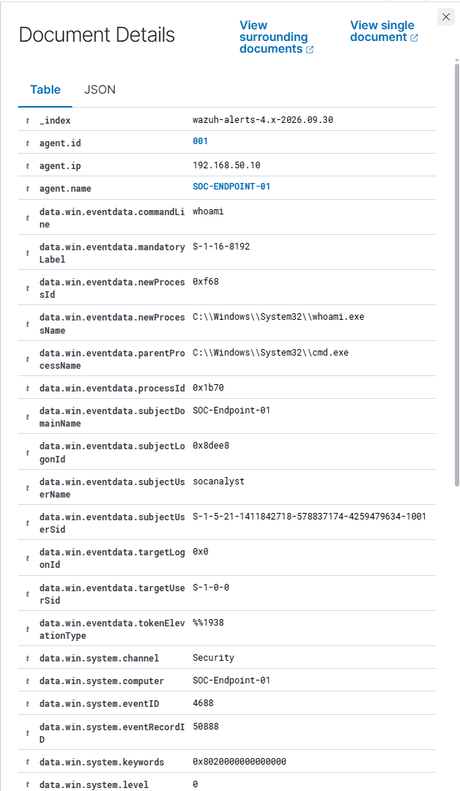
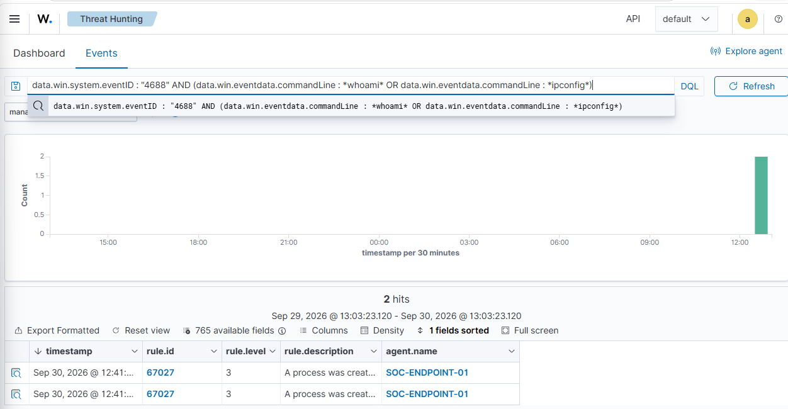

# Day 2 – Endpoint Threat Hunting with Wazuh

## Objective

The objective of Day 2 was to use the Windows process and PowerShell telemetry configured during Day 1 to perform endpoint threat hunting in Wazuh.

Rather than focusing on authentication events, this investigation focused on process execution and PowerShell activity. I used Windows Event ID 4688 and PowerShell Event ID 4104 to investigate:

- Process creation
- Command-line arguments
- Parent-child process relationships
- PowerShell script-block content
- User context
- Discovery-related commands
- Query refinement and noise reduction

The goal was to move from simply collecting endpoint telemetry to using that telemetry to investigate behaviour.

---

## 1. Establishing a Process Creation Baseline

I began with a broad search for Windows Event ID 4688:

```text
data.win.system.eventID : "4688"
```

This returned approximately 1,595 process creation events within the selected 24-hour period.



This demonstrated an important challenge when threat hunting: process creation telemetry can generate a large amount of data.

Searching all process creation events without a hypothesis or additional filtering would require an analyst to manually investigate a significant amount of normal system activity.

The next stages therefore focused on narrowing the dataset using process names, command-line arguments and parent-child relationships.

---

## 2. Hunting for PowerShell Process Creation

I investigated PowerShell execution using Event ID 4688.

The event contained fields including:

- `newProcessName`
- `parentProcessName`
- `subjectUserName`
- `processId`

The captured event showed `powershell.exe` being created with `explorer.exe` as its parent process.



Process names alone provide limited context. Parent process information helps determine how an application was launched and can be useful when reconstructing process relationships during an investigation.

---

## 3. Analysing PowerShell Command-Line Arguments

I then examined the command-line information associated with PowerShell process creation.



The `commandLine` field recorded both the PowerShell executable and the arguments supplied to it.

For example, the test activity included:

```powershell
Write-Output 'SOC-Day2-CommandLine-Test'
```

This demonstrated why command-line auditing is valuable for endpoint investigations.

Knowing that `powershell.exe` executed is useful, but the command-line arguments provide additional context about what the process was instructed to do.

---

## 4. PowerShell Script Block Analysis – Event ID 4104

Process creation telemetry does not provide the same level of PowerShell-specific visibility as Script Block Logging.

I therefore investigated PowerShell Event ID 4104:

```text
data.win.system.eventID : "4104"
```

The events contained the `scriptBlockText` field, allowing PowerShell content to be examined directly.



One captured event contained PowerShell activity involving `secedit`, including exporting security policy information and searching the resulting configuration.

This demonstrated the additional visibility provided by PowerShell Script Block Logging compared with relying only on process creation events.

---

## 5. CMD Process Analysis

I also investigated Command Prompt execution through Event ID 4688.



The event showed:

```text
Parent Process: explorer.exe
        ↓
New Process: cmd.exe
```

The event also contained the associated user and command-line information.

This allowed the process execution to be examined in context rather than treating `cmd.exe` as an isolated event.

---

## 6. Reconstructing a Parent-Child Process Relationship

I generated discovery activity using `whoami` from Command Prompt and then located the corresponding process creation event.



The telemetry showed:

```text
explorer.exe
     ↓
cmd.exe
     ↓
whoami.exe
```

The `whoami.exe` event identified:

```text
Command Line: whoami
Parent Process: cmd.exe
User: socanalyst
Event ID: 4688
```

This demonstrated how individual process creation events can be correlated through parent-child relationships to reconstruct execution activity.

A command such as `whoami` is not malicious by itself. It is a legitimate Windows utility. However, commands used for account, system or network discovery can become relevant when they occur in suspicious context or as part of a larger sequence of activity.

---

## 7. Reducing Noise During Threat Hunting

The initial Event ID 4688 query produced approximately 1,595 events.

I progressively narrowed the dataset using additional fields.

First, I focused on command-shell activity involving CMD and PowerShell.

I then searched command-line telemetry for discovery-related commands:

```text
data.win.system.eventID : "4688" AND
(data.win.eventdata.commandLine : *whoami* OR
 data.win.eventdata.commandLine : *ipconfig*)
```

This reduced the dataset to two matching events.



The progression was:

```text
~1,595 process creation events
              ↓
     CMD / PowerShell activity
              ↓
       49 shell events
              ↓
 Discovery command filtering
              ↓
        2 relevant events
```

This demonstrated how threat-hunting queries can progressively reduce a large amount of endpoint telemetry into a smaller dataset relevant to a specific hunting hypothesis.

---

## 8. Reusable Threat-Hunting Queries

During the investigation I developed a small set of reusable Wazuh DQL queries.

### Process Creation

```text
data.win.system.eventID : "4688"
```

Used to establish a broad view of process execution.

### Processes Spawned by CMD

```text
data.win.system.eventID : "4688" AND
data.win.eventdata.parentProcessName : *cmd.exe
```

This returned 10 events during testing and can be used to investigate processes launched from Command Prompt.

### Processes Spawned by PowerShell

```text
data.win.system.eventID : "4688" AND
data.win.eventdata.parentProcessName : *powershell.exe
```

This returned 76 events during testing and can be used to examine child processes created by PowerShell.

### Discovery Activity

```text
data.win.system.eventID : "4688" AND
(data.win.eventdata.commandLine : *whoami* OR
 data.win.eventdata.commandLine : *ipconfig* OR
 data.win.eventdata.commandLine : *systeminfo* OR
 data.win.eventdata.commandLine : *netstat*)
```

This hunt searches for several Windows utilities that may be used during system, account or network discovery.

These utilities also have legitimate administrative uses, so matching the query should be treated as a starting point for investigation rather than evidence of malicious activity.

### PowerShell Script Blocks

```text
data.win.system.eventID : "4104"
```

Used to investigate PowerShell script-block telemetry.

### Searching PowerShell Content

```text
data.win.system.eventID : "4104" AND
data.win.eventdata.scriptBlockText : *secedit*
```

This narrowed the 4104 dataset to script blocks containing `secedit`.

---

## Key Findings

The investigation demonstrated that Event ID 4688 provides useful process execution information, particularly when command-line auditing is enabled.

Parent process information can be used to reconstruct relationships between processes rather than analysing each event independently.

PowerShell Event ID 4104 provides additional visibility into PowerShell activity through captured script-block content.

The investigation also demonstrated that broad endpoint searches can generate significant noise. Combining fields such as event ID, process name, parent process and command-line content can substantially reduce the number of events requiring investigation.

Most importantly, the presence of tools such as PowerShell, CMD, `whoami`, `ipconfig` or `secedit` should not automatically be classified as malicious. Their significance depends on execution context, user activity, process relationships and surrounding events.

---

## Skills Demonstrated

- Windows endpoint threat hunting
- Wazuh Threat Hunting
- Windows Event ID 4688 analysis
- PowerShell Event ID 4104 analysis
- Process command-line analysis
- Parent-child process correlation
- PowerShell Script Block analysis
- DQL query construction
- SIEM noise reduction
- Behaviour-focused investigation
- Development of reusable threat-hunting queries

---

## Conclusion

Day 2 moved from telemetry collection into active endpoint threat hunting.

Using the logging configured during Day 1, I investigated process execution, command-line arguments, PowerShell script blocks and parent-child process relationships in Wazuh.

Starting with approximately 1,595 process creation events, I used progressively more specific queries to isolate activity relevant to the hunting hypothesis. This demonstrated how endpoint telemetry can be transformed from a large collection of events into focused investigative evidence.

The hunting techniques developed during this stage will be used during Day 3 to begin converting identified behaviours into custom endpoint detections.
