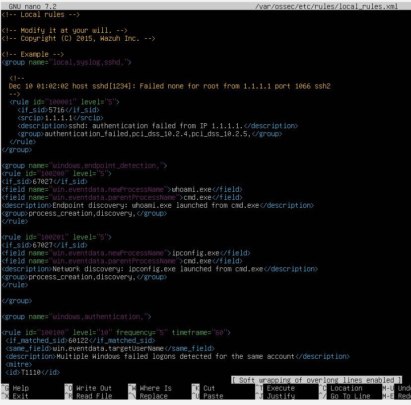
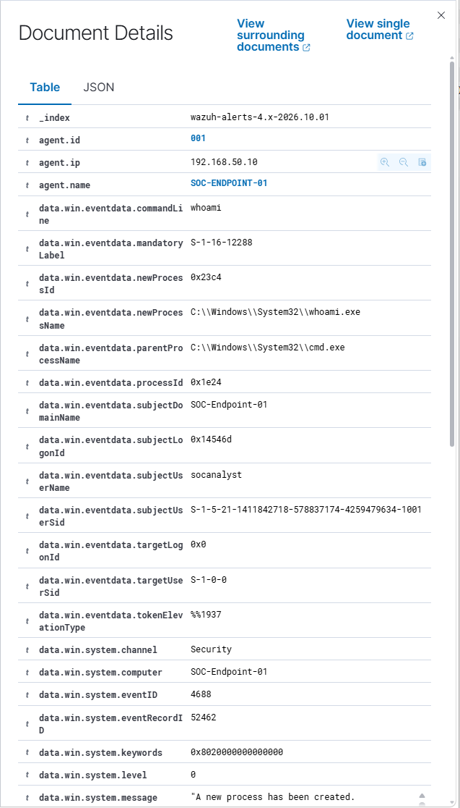
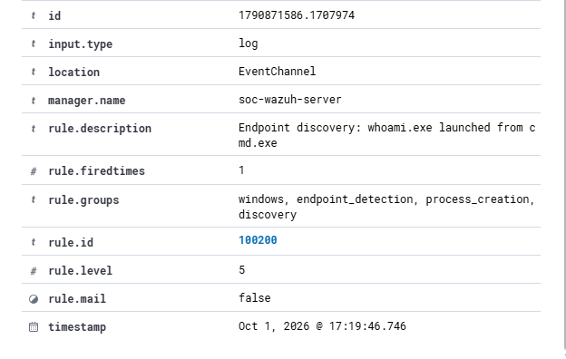
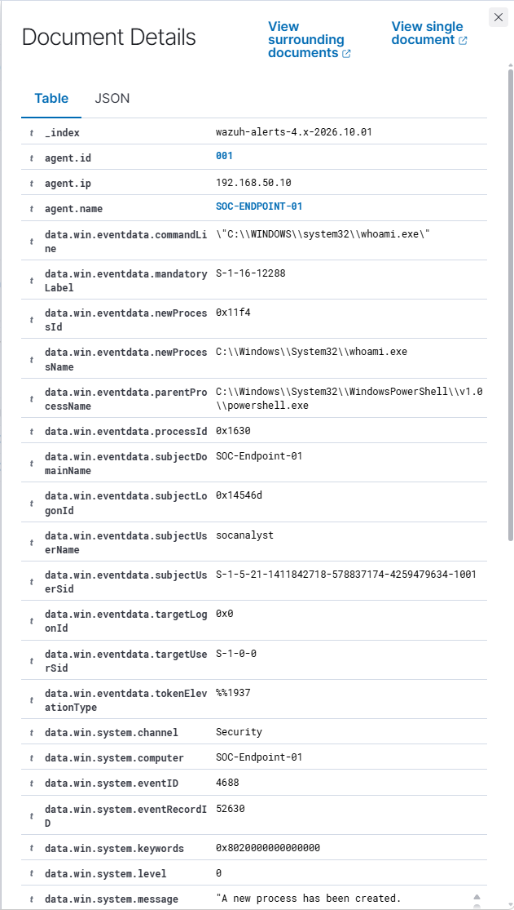
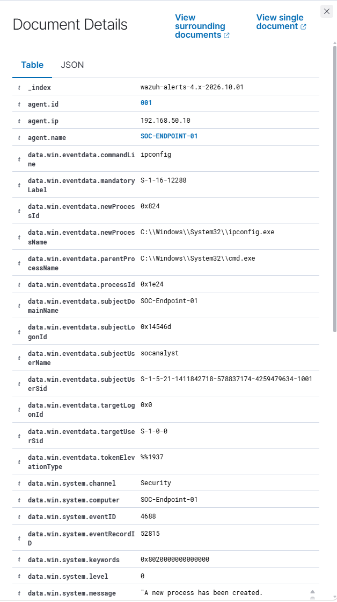
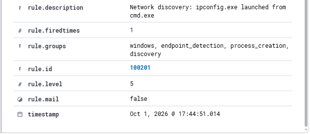

# Day 3 – Custom Endpoint Detections

## Objective

The aim of Day 3 was to take the process activity investigated during Day 2 and turn it into custom Wazuh detection rules.

I focused on Windows Event ID 4688 and used process and parent process information to create more specific detections.

Two custom rules were created:

- `cmd.exe to whoami.exe`
- `cmd.exe to ipconfig.exe`

---

## Custom Wazuh Rules

I added two new rules to the Wazuh `local_rules.xml` file.

Rule `100200` detects `whoami.exe` when it is launched from `cmd.exe`.

Rule `100201` detects `ipconfig.exe` when it is launched from `cmd.exe`.

Both rules use Wazuh process creation rule `67027` and then check the process and parent process fields.



Before restarting Wazuh, I checked the rules for configuration errors using:

```bash
sudo /var/ossec/bin/wazuh-analysisd -t
```

The configuration passed without errors and the Wazuh manager was restarted.

---

## Rule 100200 – Whoami Detection

To test the first rule, I opened Command Prompt on `SOC-ENDPOINT-01` and ran:

```cmd
whoami
```

Wazuh captured the process creation as Event ID 4688.

The event showed:

- Command line: `whoami`
- New process: `C:\Windows\System32\whoami.exe`
- Parent process: `C:\Windows\System32\cmd.exe`
- Event ID: `4688`



The activity matched Rule `100200` and generated a level 5 Wazuh alert.



---

## Negative Test

I also ran `whoami` from PowerShell instead of Command Prompt.

The process was still recorded by Event ID 4688, but the parent process was now:

```text
C:\Windows\System32\WindowsPowerShell\v1.0\powershell.exe
```

instead of:

```text
C:\Windows\System32\cmd.exe
```



This helped show why using the parent process as part of the detection is useful. The same executable can appear in different process relationships depending on how it was launched.

---

## Rule 100201 – Ipconfig Detection

The second rule was created to detect `ipconfig.exe` being launched from `cmd.exe`.

I generated the activity by running:

```cmd
ipconfig
```

Wazuh again recorded the process using Event ID 4688.

The event showed:

- Command line: `ipconfig`
- New process: `C:\Windows\System32\ipconfig.exe`
- Parent process: `C:\Windows\System32\cmd.exe`
- Event ID: `4688`



Rule `100201` successfully matched the activity and generated a level 5 alert.



---

## Results

Both custom rules successfully detected the process behaviour they were designed to identify.

| Rule | Detection | Result |
|---|---|---|
| `100200` | `cmd.exe → whoami.exe` | Detected |
| `100201` | `cmd.exe → ipconfig.exe` | Detected |

The testing also showed that process context matters. Looking at the parent process alongside the executable provides more information than detecting the executable name by itself.

---

## What I Learned

Day 3 gave me practical experience creating and testing custom Wazuh detection rules.

I learned how to:

- Turn threat hunting findings into detection rules
- Use Windows Event ID 4688 for process-based detections
- Use parent and child process relationships in detection logic
- Validate Wazuh rules before deploying them
- Generate controlled activity to test a detection
- Compare different process relationships when testing a rule

This built on the threat hunting work from Day 2 by moving from investigating endpoint activity to creating detections for specific behaviour.
